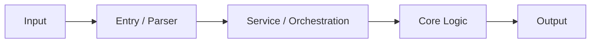

# architecture.md

This document describes the project's system structure, module boundaries, data flow, architecture invariants, and extension points.

This document does not cover:

- Agent work rules: see `AGENTS.md`
- PR process: see `PR_Checklist.md`
- Testing strategy: see `TESTING.md`
- Capability boundaries, responsibility boundaries, and agent behavior commitments: see `capability_contract.json`
- User-visible behavior: see `interact.md`
- First-time business-user teaching: see `docs/business_user_guide.md`
- Standard operating procedures: see `SOP.md`

---

## 0. Update Triggers

Update this document when a change affects:

- Core modules added or removed
- Module responsibility boundaries
- Runtime call flow
- Data flow, data contracts, or schema
- State model
- Error handling model
- External dependencies, authentication, or configuration entrypoints
- Important extension points
- Important architecture debt or constraints

---

## 1. System Purpose

<!--
Use no more than five sentences.
Explain:
- Who does this system serve?
- What are the inputs?
- What are the outputs?
- What is the core value?
-->

This system is used for:

Inputs:

Outputs:

Core value:

---

## 2. Architecture Invariants

<!--
An invariant is a system-level constraint that must remain true as the code evolves.
-->

### 2.1 Invariant Name

- Positive statement:
- Negative statement:
- Scope:
- Review check:
- Automated check, if any:
- Consequence if violated:

---

## 3. Module Responsibility Boundaries

| Module / Directory | Responsibility | Non-responsibility | May Depend On | Must Not Depend On |
|---|---|---|---|---|
|  |  |  |  |  |

### 3.1 Boundary Rules

-
-
-

---

## 4. Main Data Flow

<!--
Keep the main flow to at most three layers; complex capabilities can have their own subflow.
-->

